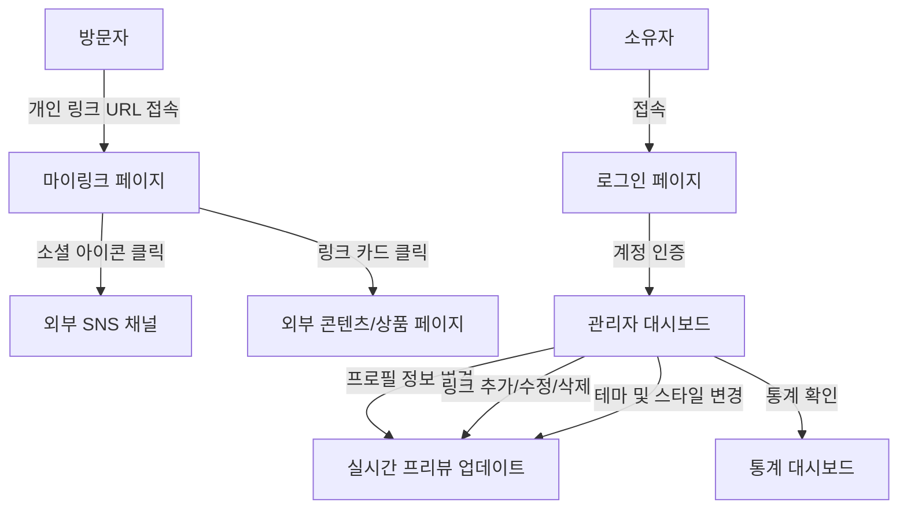
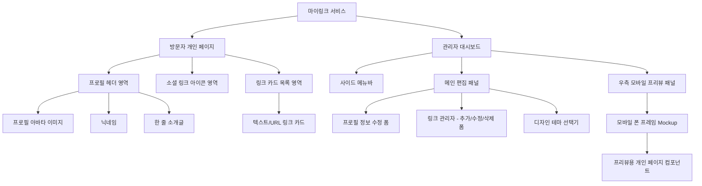

# 마이링크 (MyLink) UI 구조 및 와이어프레임 설계

본 문서는 마이링크 서비스의 UI 컴포넌트 구조, 페이지 흐름, 그리고 주요 화면에 대한 와이어프레임을 다이어그램과 ASCII 아트를 사용하여 정의합니다.

---

## 1. UI 구조 다이어그램 (Mermaid)

### 1.1. 페이지 간 화면 흐름도 (Screen Flow)
방문자와 서비스 소유자(크리에이터) 각각의 진입 및 화면 이동 경로를 보여줍니다.



### 1.2. 컴포넌트 계층 구조 (Component Hierarchy)
화면에 렌더링되는 구성 요소들의 구조적 계층 구조입니다.



---

## 2. ASCII 아트 와이어프레임 (Wireframe)

### 2.1. 모바일 방문자용 링크 페이지 (Mobile Bio-Link Page)
모바일 기기에 최적화된 단순하고 직관적인 레이아웃의 방문자 전용 페이지입니다.

```text
+-----------------------------------+
|               [ ]                 | <-- 프로필 아바타 이미지 (둥글게)
|                                   |
|            @creator               | <-- 크리에이터 닉네임
|    "세상의 모든 링크를 한곳에"    | <-- 한 줄 소개글
|                                   |
|       (Insta) (Youtube) (X)       | <-- 소셜 링크 아이콘 (O-03)
|                                   |
|  +-----------------------------+  |
|  |       📚 나의 포트폴리오     |  | <-- 텍스트/URL 링크 블록 1 (F-03)
|  +-----------------------------+  |
|  |      🎥 최신 유튜브 동영상   |  | <-- 텍스트/URL 링크 블록 2 (F-03)
|  +-----------------------------+  |
|  |      🛍️ 공식 굿즈 샵          |  | <-- 텍스트/URL 링크 블록 3 (F-03)
|  +-----------------------------+  |
|                                   |
|            [ MyLink ]             | <-- 서비스 로고 / 워터마크
+-----------------------------------+
```

### 2.2. PC용 관리자 대시보드 (Admin Dashboard)
좌측의 편집 영역과 우측의 실시간 모바일 프리뷰 영역으로 구성된 PC용 2단 분할 레이아웃 화면입니다.

```text
+-----------------------------------------------------------------------------------+
|  [MyLink Admin]                                                      Log out |
+-------------+----------------------------------------------+----------------------+
|             |  [ 링크 관리 ]      [ 프로필 설정 ]   [ 디자인 ] |  [ 실시간 미리보기 ]  |
|   ( Menu )  +----------------------------------------------+                      |
|             |                                              |  +----------------+  |
|  - 링크     |  +----------------------------------------+  |  |      [ ]       |  |
|    콘텐츠   |  |  + [새 링크 추가]                      |  |  |                |  |
|             |  +----------------------------------------+  |  |    @creator    |  |
|  - 디자인   |  |  [=] 📚 나의 포트폴리오          [Edit] |  |  | "세상의 모든..."|  |
|             |  |      URL: https://portfolio.com        |  |  |                |  |
|  - 애널리   |  |  [=] 🎥 최신 유튜브 동영상       [Edit] |  |  | (Insta) (Yt)   |  |
|    틱스     |  |      URL: https://youtube.com/...      |  |  | +------------+ |  |
|             |  |  [=] 🛍️ 공식 굿즈 샵             [Edit] |  |  | | 포트폴리오 | |  |
|             |  |      URL: https://shop.com             |  |  | +------------+ |  |
|             |  +----------------------------------------+  |  | | 유튜브 영상| |  |
|             |                                              |  | +------------+ |  |
|             |  [ 통계 요약 (기본) ]                          |  |  [ MyLink ]    |  |
|             |  - 총 링크 클릭 수: 1,240회                    |  +----------------+  |
|             |                                              |   (모바일 프리뷰 화면) |
+-------------+----------------------------------------------+----------------------+
```
